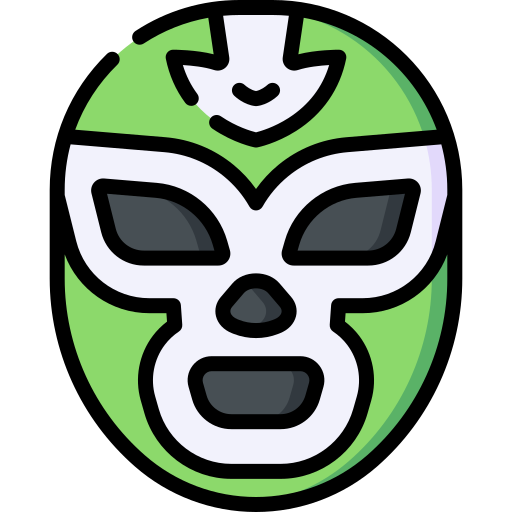

<html lang="es">
<head>
    <meta charset="UTF-8">
    <meta name="viewport" content="width=device-width, initial-scale=1.0, maximum-scale=1.0, user-scalable=no">
    
    <title>Luchas por las Finanzas de México</title>
    <meta name="description" content="Juego educativo financiero del Dr. Ambrosio Ortiz. Aprende sobre ingresos, gastos y riesgos en el ring de la economía.">
    <meta property="og:title" content="Luchas por las Finanzas de México">
    <meta property="og:description" content="¡Súbete al ring y defiende tu dinero! Un juego educativo del IPN.">
    <meta property="og:image" content="wrestling_6769709.png">
    <meta property="og:url" content="https://ambrosioortizramirez.link">
    <meta name="theme-color" content="#E4007C">
    
    <link href="https://cdn.jsdelivr.net/npm/bootstrap@5.3.0/dist/css/bootstrap.min.css" rel="stylesheet">
    <link href="https://fonts.googleapis.com/css2?family=Bangers&family=Roboto+Condensed:wght@700&display=swap" rel="stylesheet">
    <link rel="stylesheet" href="https://cdnjs.cloudflare.com/ajax/libs/font-awesome/6.4.0/css/all.min.css">

    
</head>
<body>

    

        

    

    

        <i class="fas fa-mobile-alt fa-3x mb-3" style="transform: rotate(90deg);"></i>
        <h3>Por favor, gira tu dispositivo</h3>
        
Este juego está optimizado para modo vertical en móviles.

    

    

        
        

            

                
                

                

                    
                    <h1 class="main-title lucha-font">LUCHAS POR LAS FINANZAS DE MÉXICO</h1>
                

                

                    
<strong>Dr. Ambrosio Ortiz Ramírez</strong>

                    <a href="https://www.researchgate.net/profile/A-Ortiz-Ramirez" target="_blank"><i class="fas fa-graduation-cap"></i> ResearchGate</a> | 
                    <a href="https://orcid.org/0000-0002-3698-2873" target="_blank"><i class="fab fa-orcid"></i> ORCID</a>
                

                
                

                    <a href="https://www.flaticon.es/iconos-gratis/luchador" title="luchador iconos" target="_blank" style="color: #777; text-decoration: none;">Luchador iconos creados por Freepik - Flaticon</a>
                

                

                    🏆 Tu Récord: 0
                

                
elige tu cuadrilátero:

                

                    <button class="btn btn-lucha btn-nivel-1 d-flex justify-content-between px-3 align-items-center" onclick="initLevel(1)">
                        🪙 TANDA <small>Corto Plazo</small>
                    </button>
                    <button class="btn btn-lucha btn-nivel-2 d-flex justify-content-between px-3 align-items-center" onclick="initLevel(2)">
                        🚲 BICI <small>Mediano Plazo</small>
                    </button>
                    <button class="btn btn-lucha btn-nivel-3 d-flex justify-content-between px-3 align-items-center" onclick="initLevel(3)">
                        ✈️ VIAJE <small>Largo Plazo</small>
                    </button>
                

                <a href="https://econ-master-8w1z.vercel.app/" target="_blank" class="btn btn-lucha w-100 py-2 text-white fw-bold text-decoration-none d-block mb-2" style="background: var(--morado-mx); border-color: black; display: none;">
                    🪅 JUGAR PIÑATAS DE LA ECONOMÍA
                </a>

                <button class="btn btn-lucha w-100 py-2 btn-success text-white fw-bold" style="background: var(--verde-mx); border-color: black;" onclick="confirmEconMaster()">
                    <i class="fas fa-gamepad me-2"></i> JUGAR ECONMASTER
                </button>
            

        

        

            

                

                    

                

            

            

                

                    ❤️❤️❤️
                    <i class="fas fa-check-circle"></i> 0
                    <i class="fas fa-times-circle"></i> 0
                    <i class="fas fa-clock"></i> 60
                

                

                    

 
                    
<i class="fas fa-chevron-up"></i>

                    

 
                    
<i class="fas fa-chevron-left"></i>

                    
<i class="fas fa-chevron-down"></i>

                    
<i class="fas fa-chevron-right"></i>

                

                

                    <button class="btn btn-warning rounded-circle border-2 border-dark shadow-sm" style="width:45px; height:45px" onclick="toggleMusic()" id="music-btn"><i class="fas fa-volume-up"></i></button>
                    <button class="btn-salir" onclick="exitToMenu()">SALIR</button>
                

            

        

    

    

        

            

                
                <h3 class="lucha-font" style="color: var(--azul-titulo);">Ambrosio Ortiz Ramírez</h3>
            

            

                
<strong>Ambrosio Ortiz Ramírez</strong> es Profesor Investigador en el <strong>IPN</strong> y miembro del <strong>SNI Nivel 1</strong>.

                
Especialista en <strong>Econometría Financiera y Riesgos</strong>, combina la investigación académica rigurosa con la divulgación accesible a través de su proyecto <em>"Divulgando las Finanzas"</em>.

            

            <button class="btn btn-lucha w-100 mt-3 btn-success text-white" onclick="showModal(null)">CERRAR</button>
        

    

    

        

            <h2 class="lucha-font text-success">¿Ir a EconMaster?</h2>
            
Saldrás de este juego para ir a otro sitio educativo.

            

                <button class="btn btn-secondary w-50" onclick="showModal(null)">Cancelar</button>
                <button class="btn btn-success w-50 fw-bold" onclick="goToEconMasterReal()">¡VAMOS!</button>
            

        

    

    

        

            <h2 class="lucha-font text-danger">¡EL RETO!</h2>
            
Nivel: <strong id="inst-goal" style="color:var(--morado-mx)"></strong>

            

                Recolecta <strong>Activos</strong> y evita los <strong>Pasivos</strong> para llegar al trofeo.
            

            

                
✅ BUENO Inversión, Ahorro, Cetes, Seguro.

                
❌ MALO Inflación, Deuda, Fraudes, Gasto Vampiro.

            

            <button class="btn btn-lucha w-100 py-2 fs-4 fw-bold" style="background:var(--verde-mx); color:white;" onclick="startGame()">¡A LUCHAR!</button>
        

    

    

        

            
🔔

            <h2 class="lucha-font text-danger">¡TE RINDIERON!</h2>
            
...

            

                <strong>💡 El Experto dice:</strong> 
                ...
            

            <button class="btn btn-lucha btn-dark w-100 mt-2" onclick="exitToMenu()">REINTENTAR</button>
        

    

    

        

            
🏆

            <h2 class="lucha-font text-success">¡CAMPEÓN!</h2>
            
...

            

                <strong>💡 Consejo de Oro:</strong> 
                ...
            

            <button class="btn btn-lucha w-100 mt-2" style="background:var(--amarillo-mx)" onclick="exitToMenu()">GENIAL</button>
        

    

    
    
</body>
</html>
